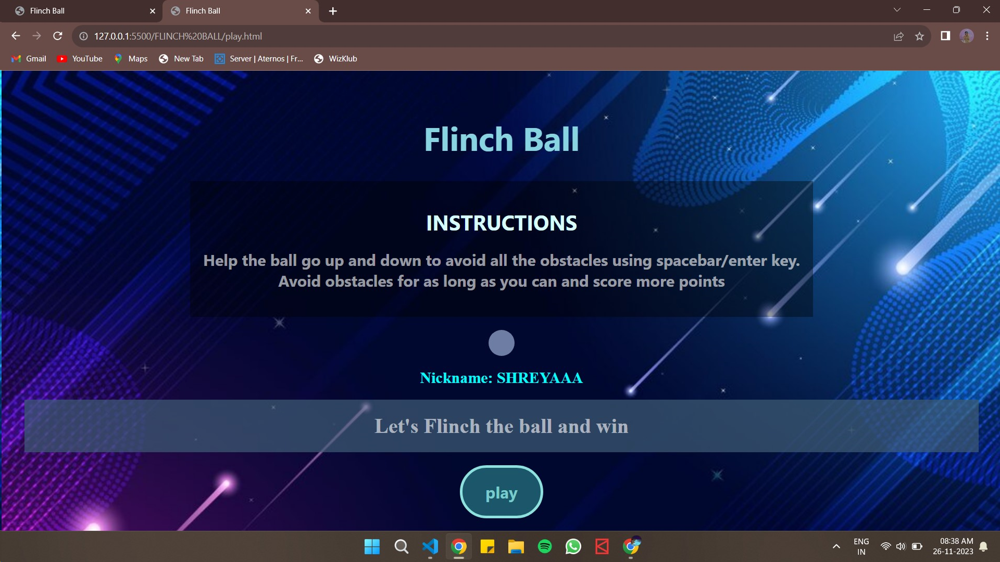

#FLINCH-BALL-Game-Dev-
#FEWD CA-2
#This game is developed using vanilla HTML, CSS and JavaScript.

#How to play:
1. In this game you have to choose an username to start with the game first.
2. At first you have to click spacebar to start the game.
3. While playing spacebar key will make the ball jump up.
4. According to the obstacles you have to use the key to save ball from hitting the obstacles.
5. Your score will be increasing depending on how much time you survive without hitting the obstacles.

#deployed link:

#References: https://youtu.be/3SsYZDJdeXk?feature=shared
             https://youtu.be/lGJ9i6CYKyQ?feature=shared

#Screenshots: 
RESPONSIVE

DESKTOP

